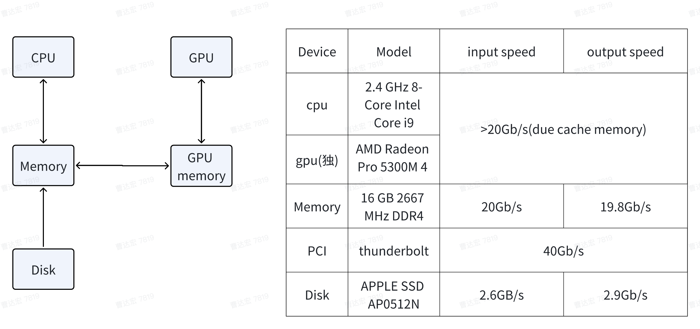
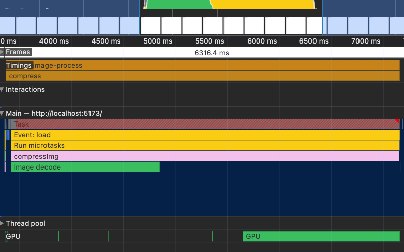
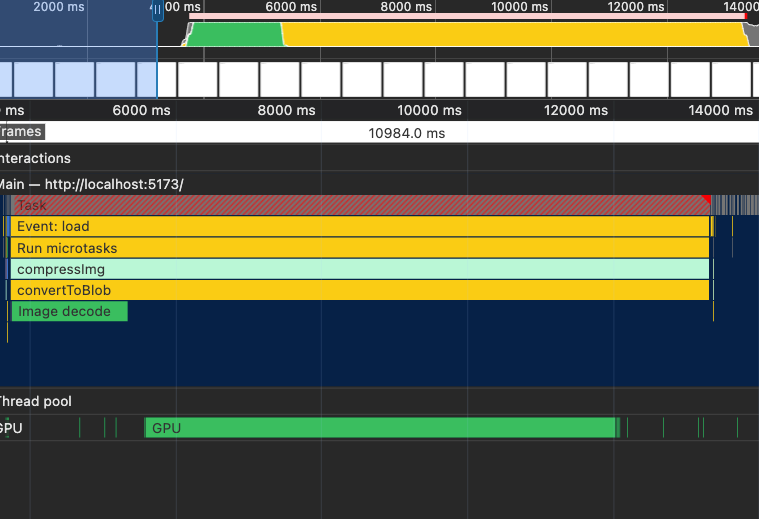
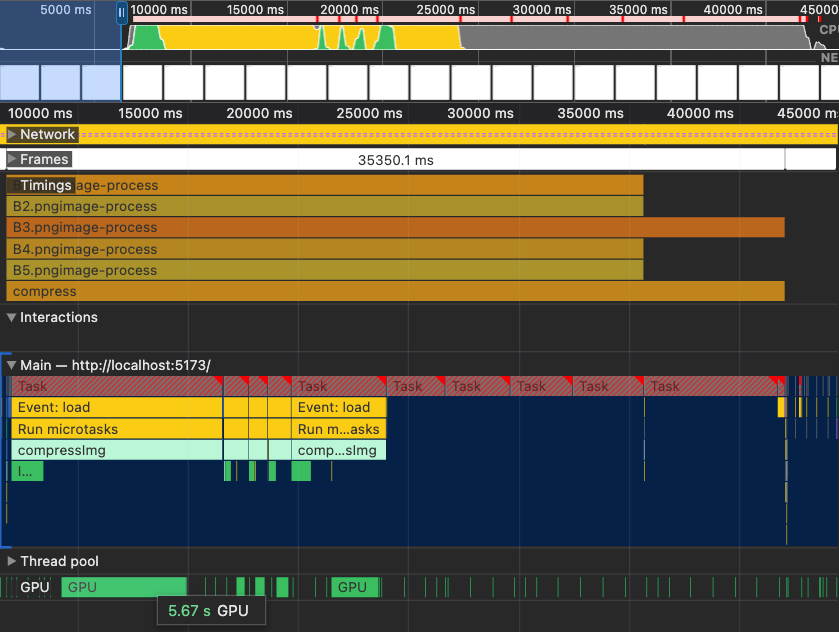
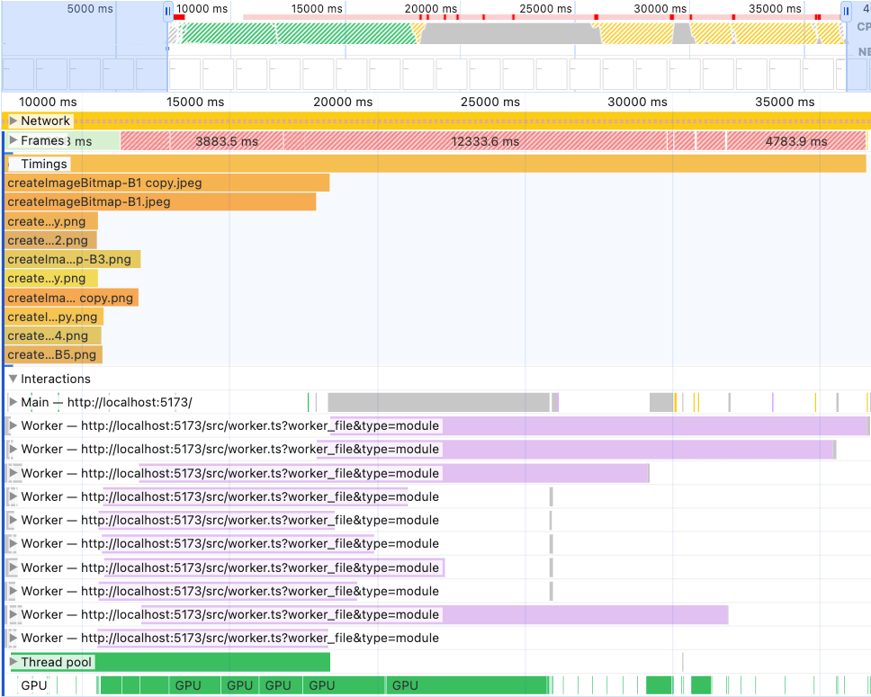
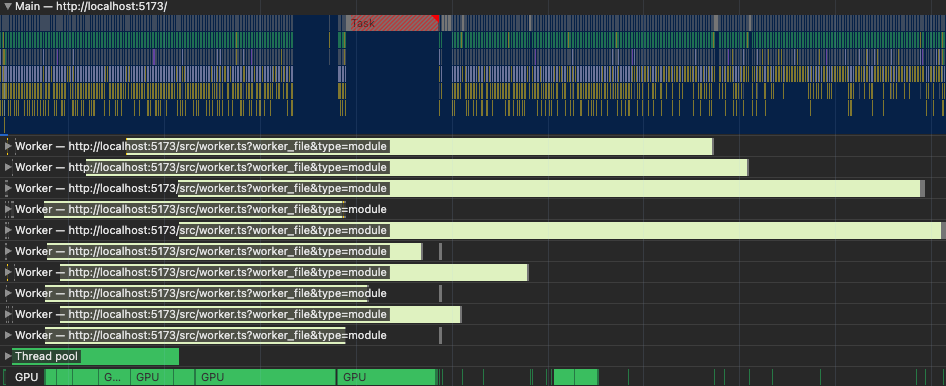
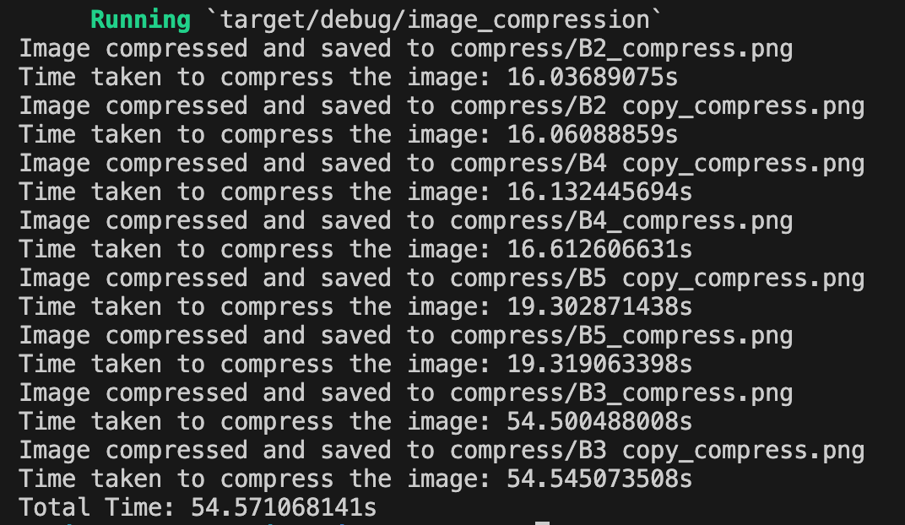
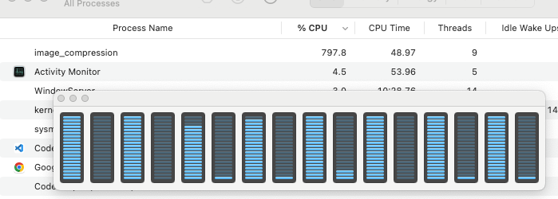

# web image compression

## Project Results:

Frontend Multithreaded Image Compression Project On the author's computer, compressing 10 ultra-large images (average 42.3 Mb per image) took about 25 seconds on average. Ignoring the ultra-large 400 million pixel image and its copy, the remaining 8 images can be completed in 12 seconds (for comparison, even using Rust, known for its high performance, with 8 threads to compress these 8 images takes 54 seconds).

### webp encoding:

It takes a bit longer due to webp coding is complex than jpg, about 27 seconds (fastest 24 seconds, slowest 30 seconds), but the image size is very small, generally not exceeding 2Mb. The author visually judged that the quality did not lose much. If unsure, it can be verified by design. (It needs to be drawn in an unconventional ImageBitmap way, conventional Image drawing cannot be encoded into webp, and there is no effective error message, only a timeout error).

### jpg encoding:

Encoding and decoding efficiency is higher, taking about 25 seconds on average (fastest 21 seconds), but the compressed image size is much larger, especially png, which may not change much compared to the original size, and there is a risk of needing multiple compressions.

## tech

-   use web worker
-   support webp format
-   limit file size
-   limit img width and height

## How to use

### Installation

```sh
pnpm add @h-bird/img-compress
```

### use

```ts
import CEngine, { type CompressOptions } from "zhiwen-img-compress";
const option: CompressOptions = {
    useWebp: false,
    quality: 0.9,
    fileSizeLimit: 30,
    lenSizeLimit: 8192,
};
const inputElement = document.querySelector('input[type="file"]');
inputElement.addEventListener("change", async (event) => {
    for (let file of input.files) {
        const { size: beforeSize, name } = file;
        // do not use await in this step, which will make parallel change to serial
        const promise = CEngine.runCompress(file, defaultConfig);
        promise.then((blob) => {
            // do something for blob
        });
    }

    // or you can to in this way 
    const promises = []
    for (let file of input.files) {
        const { size: beforeSize, name } = file;
        // do not use await in this step, which will make parallel change to serial
        const promise = CEngine.runCompress(file, defaultConfig);
        promises.push(promise)
    }
    const blobs = await promise.all()
    // do something for blobs
});
```

## Tech background

### Conclusion:

-   When compressing ultra-large images, the huge data throughput will cause CPU/GPU stuttering. Multithreading can improve CPU encoding and decoding efficiency, but it cannot solve the memory wall or GPU issues (frontend multithreading test diagram).
    -   For example, a test image received by the author, a 20000 x 20000 jpg image, is 32 Mb before decoding, and its size will reach 1.6 Gb after full decoding. This data needs to be transferred to memory and then to video memory through the bus. The graphics card then performs 1.6 Gb data calculation and rendering. The redrawn data is then transferred back to the GPU for encoding and compression.
    -   The memory wall problem refers to the exhaustion of high-speed cache when processing ultra-large data (such as this GB-level image data), and subsequent data cannot be preloaded. The computing core capabilities cannot be fully utilized. Both CPU and GPU will encounter this problem (AI graphics cards are optimized in this regard compared to conventional graphics cards).
    -   In theory, some resources can be forcibly allocated for page refresh to reduce stuttering, but no suitable API method has been found so far (Apple's M series computers seem to have no UI stuttering, possibly due to better GPU resource scheduling).
-   Compressing oversized images can greatly reduce the file size:
    -   Currently, the maximum size of a product in our company is 250 cm. Setting the ppi to 72, the corresponding pixel size is 250 cm \* 72 px / inch / 2.54 cm/inch = 7086 px. Take 2^13 = 8096 px.
-   Using the webp format instead of png/jpg can greatly reduce the image file size:
    -   WebP is a modern image format introduced by Google that provides excellent lossless and lossy compression for images on the web. Using WebP, webmasters and web developers can create smaller, richer images that make the web faster. Most browsers now support it.
        Using web workers (a frontend multithreading technology) can speed up image encoding and decoding.

#### Experiment Details:

-   Original data: 10 images (2 jpeg + 8 png, average 42.25 Mb per image)
-   Frontend Test: Time: 25553 ms
-   Test computer configuration:



#### Single 400 million pixel image compression process time analysis:

-   Red text indicates multithreading acceleration is possible.
-   Yellow background indicates data guessed through experimental data, with large possible errors.

| Process        | Data Size (Mb)                       | Max Bandwidth (Gb/s)                 | Min Time (ms)                        | Actual Time (ms) |
| -------------- | ------------------------------------ | ------------------------------------ | ------------------------------------ | ---------------- |
| Disk -> Memory | 32                                   | 2.90                                 | 11                                   | 23               |
| Memory -> CPU  | 32                                   | 20.00                                | 2                                    | 1600             |
| CPU Decode     | <span style="color:red">1600 </span> | <span style="color:red">1.00</span>  | <span style="color:red">1600 </span> |                  |
| CPU -> Memory  | 1600                                 | 20.00                                | 80                                   |                  |
| Memory -> VRAM | 1600                                 | 40.00                                | 40                                   |                  |
| VRAM -> GPU    | 1600                                 | 20.00                                | 80                                   |                  |
| GPU Render     | 400                                  | 0.10                                 | 4000                                 | 4500             |
| GPU -> VRAM    | 400                                  | 20.00                                | 20                                   |                  |
| VRAM -> Memory | 400                                  | 40.00                                | 10                                   |                  |
| Memory -> CPU  | 400                                  | 20.00                                | 20                                   |                  |
| CPU Encode     | <span style="color:red"> 2.3 </span> | <span style="color:red">0.01 </span> | <span style="color:red">230 </span>  | 200              |
| CPU -> Memory  | 2.3                                  | 20.00                                | 0                                    |                  |
| **Total**      |                                      |                                      | **6093**                             | **6323**         |

#### Single 20000 x 20000 jpg image

-   output set to 1 x 1 jpg time chart (data transfer and encoding time can be ignored at this time):
    

#### Single 20000 x 20000 jpg image,

-   output set to 10000 x 10000 jpg time chart (image decode time is basically the same as the above, GPU time extended by 3 seconds):
    

#### Multiple image performance analysis:

-   image decoding
    

#### Multithreaded processing of multiple images:



##### The process can be roughly divided into 3 parts:

-   The first part is CPU decoding + CPU data -> GPU has encountered a memory wall, opening more threads cannot accelerate, and the page stutters at this time.
-   The second part is the main part of GPU rendering (multithreading ensures that the GPU is not idle, GPU stuttering may also be due to the GPU memory wall. It is known that the big difference between AI chips and traditional graphics cards is the accelerated data reading), and the page stutters at this time.
-   The third part is the redrawn image data transfer + encoding (multithreading), the GPU is free to update the display at this time, and the page does not stutter.

#### M1-pro computer test results:


It can be seen that the GPU starts rendering much faster than Intel computers because the M1-pro uses a unified memory architecture. After CPU parsing, the image data does not need to be transferred to the GPU through the bus but can directly transfer data ownership.

### Backend Simulation Test:

The backend simulation is based on Rust implementation. The input is 8 images (because it cannot handle 20000 \* 20000 images), single compression (regardless of whether the compressed image file size meets the limit), and the output is jpg images.

During the backend test, due to memory limitations, it was found that although Rust is known for its safety and high performance, the compression efficiency is not as good as the frontend compression with GPU acceleration. Geng used node + sharp (underlying C++ image processing library) with similar performance.

#### Single-threaded processing of 8 images:

Time: 103.6 s

#### 8-thread processing of 8 images:

Time: 54.6 s
Multithreading has a significant effect on accelerating CPU compression, but since multithreading does not solve the memory wall problem, there is still a performance bottleneck. Below is the
Rust 8-thread test data:

8-thread CPU usage:

